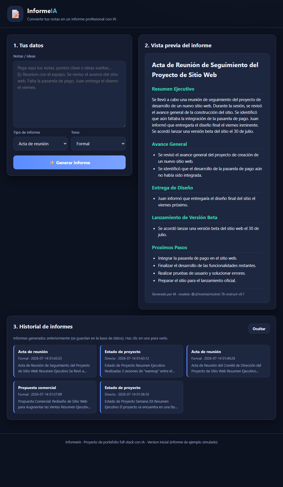

# 📝 InformeIA — Generador de informes profesionales con IA

**Demo en vivo:** https://agc-informe-ia.pages.dev

Convierte tus **notas sueltas** en un **informe profesional** con IA. Eliges el tipo de
informe y el tono, pegas tus notas y la IA redacta el documento con formato (títulos,
listas, negritas). Cada informe se **guarda en una base de datos** y puedes volver a verlo
desde el historial.



## ✅ Cómo se usa (en palabras simples)

1. **Escribe tus notas** o puntos clave.
2. Elige el **tipo de informe** (Acta de reunión, Estado de proyecto, Propuesta comercial,
   Informe de investigación) y el **tono** (Formal, Directo, Detallado).
3. Pulsa **✨ Generar informe**: la IA redacta el documento y lo muestra con formato.
4. En **Historial** aparecen tus informes anteriores; haz clic en uno para volver a verlo.

Se usa entrando a la demo en vivo, o abriendo `index.html` (necesita el Worker en línea).

## 🧱 Stack

| Capa | Tecnología |
|------|-----------|
| Interfaz | HTML + CSS + JavaScript puro (sin CDNs), con conversor Markdown propio |
| Backend | **Cloudflare Worker** (`worker/`) con endpoints `POST /api/generar` y `GET /api/historial` (CORS) |
| IA | **Cloudflare Workers AI** · modelo `@cf/mistral/mistral-7b-instruct-v0.1` |
| Base de datos | **Cloudflare D1** (tabla `informes`) para el historial |
| Despliegue | Worker en `*.workers.dev` + web en **Cloudflare Pages** |

- **Web (Pages):** https://agc-informe-ia.pages.dev
- **API (Worker):** https://agc-informe-ia.meikimura2002.workers.dev

## 💼 Empleos que demuestra

- **Full-Stack + IA:** frontend, API (Workers), integración de LLM y despliegue.
- **Integración de LLM y prompt engineering:** generación estructurada de documentos.
- **APIs REST y persistencia:** endpoints `POST`/`GET` con guardado y consulta en **D1**.
- **Serverless en Cloudflare:** Workers, Workers AI, D1 y Pages.

## 🧪 Pruebas

```bash
node check.js
```

Verifica la interfaz (ids, sin CDNs, conexión con el Worker) y el Worker (endpoint,
binding AI, CORS). Detalle en [`SELFTEST.md`](SELFTEST.md).

## 🔧 Correr en local

```bash
# Backend (en worker/):
cd worker && npx wrangler dev        # Worker en http://localhost:8787
# En index.html, cambia WORKER_URL a http://localhost:8787 para pruebas locales.
```

---

*Proyecto de portafolio · Ciclo "Herramientas Full-Stack con IA". Genera contenido nuevo
(informes), a diferencia de proyectos previos de RAG, Q&A, extracción o automatización.*
